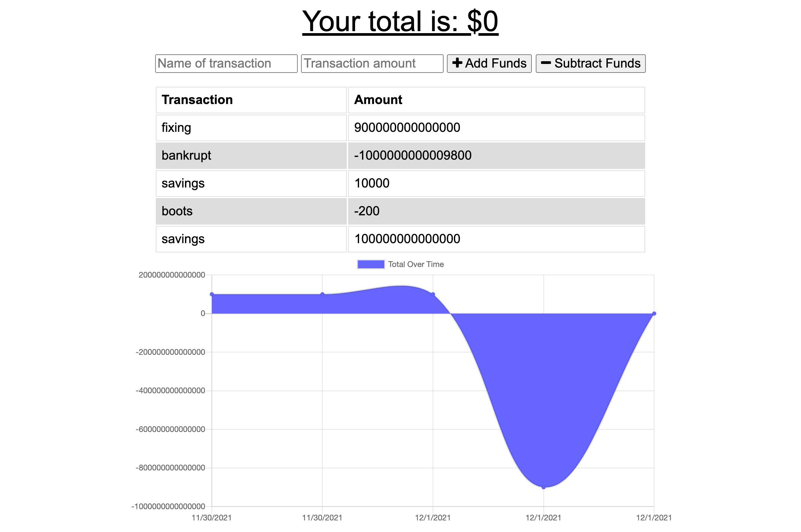

# Budget Tracker
[https://budgettrack.herokuapp.com/](https://hw-19-budgettrack.herokuapp.com/)

## Description
A simple budget tracker app that works offline.

### User Story 
```md
AS AN avid traveller
I WANT to be able to track my withdrawals and deposits with or without a data/internet connection
SO THAT my account balance is accurate when I am traveling
```

### Business Context 
```md 
Giving users a fast and easy way to track their money is important, but allowing them to access that information anytime is even more important. 
Having offline functionality is paramount to our applications success.
```


#### Credits
- Ismeny Saguilan
- Damien Luzzo 
- Nikki Dodge

### License 

